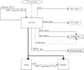
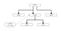
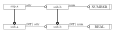
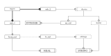
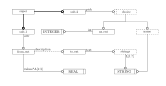
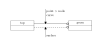
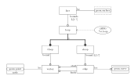
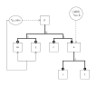

= The EXPRESS-G language

// begin notes
NB. NOTES ARE ON EVEN NUMBERED (LEFT HAND) PAGES AND THE PRESENTATION ON
ODD NUMBERED (RIGHT HAND) PAGES.

== EXPRESS-G

This part of the course covers the elements of EXPRESS-G:

* History
* Design goals
* Language elements and examples

There were three main proposals for a graphical version of
EXPRESS before the EXPRESS Committee started work in earnest. This meant
that they had some user experiences to guide them.
// end notes

== EXPRESS-G

EXPRESS-G is a graphical subset of EXPRESS lexical language and
has evolved from a variety of sources.

10/88:: EXPRESSAM (Bruce Lownsbery, Lawrence Livermore Lab)
based on NIAM.
2/89:: GREXP (Peter Wilson, GE) BLA  (boxes, lines, annotation) with
multiple levels of abstraction and any amount of text.
11/89:: ExpressGraph (Curt Parks, NIST & John Zimmerman, Allied Bendix)
simplified version of EXPRESSAM.
2/90:: EXPRESS-G (EXPRESS Committee)

// begin notes
== EXPRESS-G

The final result is yet another member of the BLA (boxes,
lines, and annotations) family. Unlike practically any other BLA
language it was based on an existing lexical language --  the others
were stand-alone.

EXPRESS-G is limited to the structural parts of EXPRESS --  no
representation of constraints, no FUNCTIONs.
// end notes

== EXPRESS-G

* Drafted by EXPRESS Committee in January 1990
* A combination of ExpressGraph and GREXP.
* A _subset_ of EXPRESS.
* Modeling of Entity, Attribute, Cardinality, Supertype, Type and Schema.
* Limited levels of abstraction.
* No ISO ballot issues in mid 1990 (Informative Annex).
* February 1991 --  Normative Annex to EXPRESS document and
extended.
* Same standardization status as EXPRESS.

// begin notes
== EXPRESS-G design Goals

As there was a full lexical language available EXPRESS-G was limited
to those things that could be easily represented graphically.

It was hoped that the diagrams could be understood with (practically)
no training. (Hopefully even non-technical managers would feel comfortable).

Different levels of abstraction (detail) would be available.

Importantly, it was known that EXPRESS-G models would be published
in reports on normal sized paper, so there had to be a means of splitting
a large diagram across a number of pages.

The icons had to be simple so simple drawing programs could be used
(at one time diagrams were drawn using ASCII art on lineprinters).

It would be useful to be able to develop software to go between
EXPRESS and EXPRESS-G modeling.
// end notes

== EXPRESS-G Design Goals

* Subset of EXPRESS.
* Intuitive understanding of diagrams.
* Support different levels of abstraction.
* Mechanism for multi-page models.
* Minimal graphic capabilities needed.
* Potential automatic EXPRESS-G display of EXPRESS models.

// begin notes
== EXPRESS-G Example Model

This is meant to be understandable by the audience --  at least the general
tenor of the model.

It is a '`2 page`' model even though it is shown on one sheet of paper.

[source%unnumbered]
----
  TYPE date = ARAY [1:3] OF INTEGER; END_TYPE;

  TYPE hair_type = ENUMERATION OF
    (blonde, brown, black, red, white, bald);
  END_TYPE;

  ENTITY person;
    first_name : STRING;
    last_name : STRING;
    nickname : STRING;
    birth_date : date;
    children : SET [0:?] OF person;
    hair : hair_type;
  DERIVE
    age : INTEGER := years(birth_date);
  INVERSE
    parents : SET [0:2] OF person FOR children;
  END_ENTITY;

  SUBTYPE_CONSTRAINT sc_person FOR person;
    ONEOF(male, female);
  END_SUBTYPE_CONSTRAINT;

  ENTITY female SUBTYPE OF (person);
  INVERSE
    husband : SET [0:1] OF male FOR wife;
  END_ENTITY;

  ENTITY male SUBTYPE OF (person);
    wife : OPTIONAL female;
  END_ENTITY;

  FUNCTION years(past : date): INTEGER
    (* returns number of years between past
       and curent date *)
  END_FUNCTION;
----
// end notes

== EXPRESS-G Example Model

[%unnumbered]
.PAGE 1 OF 2

[%unnumbered]
.PAGE 2 OF 2

// begin notes
== Definition Symbols

These are the symbols for representing the structural elements of EXPRESS,
principally TYPE, ENTITY and SCHEMA.

SUBTYPE_CONSTRAINT is a late addition.
// end notes

== Definition Symbols

[%unnumbered]
.BASE TYPES
image::images/02-symbols-1.svg[]

image::images/02-symbols-4.svg[]

[%unnumbered]
.DEFINED TYPES

[%unnumbered]
.ENTITY

[%unnumbered]
.SUBTYPE_CONSTRAINT

[%unnumbered]
.SCHEMA

// begin notes
== Relationship Symbols

Lines are used to indicate relationships between definitions.

The thickness of the line is meant to be indicative of the strength
of the relationship.

* Thick lines for supertype/subtype relationship
* Dashed line for an optional attribute of an ENTITY.
// end notes

== Relationship Symbols

[%unnumbered]
.LINE STYLES

// begin notes
== Composition Symbols

There are 2 kinds of compostion symbol

* Page connectors, where a relationship line crosses to or from
another page.
* Inter-schema references where something is defined in some other
schema than the current one.
// end notes

== Composition Symbols

[%unnumbered]
.PAGE REFERENCES

[%unnumbered]
.INTER-SCHEMA REFERENCES

// begin notes
== A Supertype Tree

[source%unnumbered]
----
SCHEMA simple_tree;

ENTITY super; END_ENTITY;

ENTITY sub1 SUBTYPE OF (super); END_ENTITY;

ENTITY sub2 SUBTYPE OF (super); END_ENTITY;

SUBTYPE_CONSTRAINT sc_sub2 FOR sub2;
  ABSTRACT;
  ONEOF(sub3, sub4);
END_SUBTYPE_CONSTRAINT;

ENTITY sub5 SUBTYPE OF (super); END_ENTITY;

ENTITY sub3 SUBTYPE OF (sub2); END_ENTITY;

ENTITY sub4 SUBTYPE OF (sub2); END_ENTITY;

END_SCHEMA; -- simple_tree
----
// end notes

[%unnumbered]
.A Supertype Tree

// begin notes
== Retyping attributes

[source%unnumbered]
----
ENTITY sup_a;
  attr : sub_b;
END_ENTITY;

ENTITY sub_a SUBTYPE OF (sup_a);
  SELF\sup_a.sub_b : sub_b;
END_ENTITY;

ENTITY sup_b;
  num : OPTIONAL NUMBER;
END_ENTIY;

ENTITY sub_b SUBTYPE OF (sup_b);
  SELF\sup_b.num : REAL;
END_ENTIY;
----
// end notes

[%unnumbered]
.Retyping attributes

// begin notes
== Partial and Complete Entity Models

[source%unnumbered]
----
ENTITY super; END_ENTITY;

ENTITY sub_1 SUBTYPE OF (super);
  attr : from_ent;
END_ENTITY;

ENTITY sub_2 SUBTYPE OF (super);
  pick : choice;
END_ENTITY;

ENTITY an_ent;
  int : INTEGER;
END_ENTITY;

ENTITY from_ent;
  description : OPTIONAL to_ent;
  values      : ARRAY [1:3] OF UNIQUE REAL;
END_ENTITY;

ENTITY to_net;
  text : strings;
END_ENTITY;

TYPE choice = SELECT
  (an_ent, name);
END_TYPE;

TYPE name = STRING; END_TYPE;

TYPE strings  LIST [1:?] OF STRING; END_TYPE;
----
// end notes

== Partial and Complete Entity Models

[%unnumbered]
.PARTIAL ENTITY LEVEL MODEL

[%unnumbered]
.COMPLETE ENTITY LEVEL MODEL

// begin notes
== Schema and Entity Models

[source%unnumbered]
----
SCHEMA top;
  USE FROM geom (curve, point AS node);
  REFERENCE FROM geom (surface);

  ENTITY face;
    bounds : LIST [1:?] OF loop;
    loc    : surface;
  END_ENTITY;

  ENTITY loop; END_ENTITY;

  SUBTYPE_CONSTRAINT sc_loop FOR loop;
    ABSTRACT;
    ONEOF(eloop, vloop);
  END_SUBTYPE_CONSTRAINT;

  ENTITY eloop SUBTYPE OF (loop);
    bound : LIST [1:?] OF edge;
  END_ENTITY;

  ENTITY vloop SUBTYPE OF (loop);
    bound : vertex;
  END_ENTITY;

  ENTITY edge;
    start, end : vertex;
    loc   : curve;
  END_ENTITY;

  ENTITY vertex;
    loc : node;
  END_ENTITY;
END_SCHEMA; -- top

SCHEMA geom;
  ENTITY lcs; END_ENTITY;
  ENTITY surface; END_ENTITY;
  ENTITY curve; END_ENTITY;
  ENTITY point; END_ENTITY;
END_SCHEMA; -- geom
----
// end notes

== Schema and Entity Models

[%unnumbered]
.SCHEMA LEVEL MODEL

[%unnumbered]
.ENTITY LEVEL MODEL

// begin notes
== Subtype Constraints

[source%unnumbered]
----
ENTITY p; END_ENTTY;  -- person

SUBTYPE_CONSTRAINT p_subs FOR p;
  TOTAL_OVER(m, f);
  ONEOF(m, f) AND ONEOF(c, a);
END_SUBTYPE_CONSTRAINT;

ENTITY m SUBTYPE OF (p); END_ENTITY; -- male

ENTITY f SUBTYPE OF (p); END_ENTITY; -- female

ENTITY c SUBTYPE OF (p); END_ENTITY; -- citizen

ENTITY a SUBTYPE OF (p); END_ENTITY; -- alien

SUBTYPE_CONSTRAINT no_li FOR a;
  ABSTRACT SUPERTYPE;
  ONEOF(l, i);
END_SUBTYPE_CONSTRAINT;

ENTITY l SUBTYPE OF (a); END_ENTITY; -- legal

ENTITY i SUBTYPE OF (a); END_ENTITY; -- illegal
----
// end notes

[%unnumbered]
.Subtype constraints

// begin notes
== Usage

May be used anywhere EXPRESS is used.

Can be used alone in its own right, but more usually employed with
EXPRESS lexical to fill in any missing details.
// end notes

== Usage

* Graphical display of EXPRESS models.
* Stand-alone information modeling iconic language.
* Model display at varying levels of abstraction.
* Model display at varying levels of granularity.

