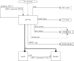
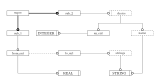
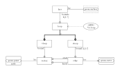

= The EXPRESS-G language

== EXPRESS-G

EXPRESS-G is a graphical subset of EXPRESS lexical language and
has evolved from a variety of sources.

10/88:: EXPRESSAM (Bruce Lownsbery, Lawrence Livermore Lab)
based on NIAM.
2/89:: GREXP (Peter Wilson, GE) BLA  (boxes, lines, annotation) with
multiple levels of abstraction and any amount of text.
11/89:: ExpressGraph (Curt Parks, NIST & John Zimmerman, Allied Bendix)
simplified version of EXPRESSAM.
2/90:: EXPRESS-G (EXPRESS Committee)

== EXPRESS-G

* Drafted by EXPRESS Committee in January 1990
* A combination of ExpressGraph and GREXP.
* A _subset_ of EXPRESS.
* Modeling of Entity, Attribute, Cardinality, Supertype, Type and Schema.
* Limited levels of abstraction.
* No ISO ballot issues in mid 1990 (Informative Annex).
* February 1991 --  Normative Annex to EXPRESS document and
extended.
* Same standardization status as EXPRESS.

== EXPRESS-G Design Goals

* Subset of EXPRESS.
* Intuitive understanding of diagrams.
* Support different levels of abstraction.
* Mechanism for multi-page models.
* Minimal graphic capabilities needed.
* Potential automatic EXPRESS-G display of EXPRESS models.

== EXPRESS-G Example Model

[%unnumbered]

[%unnumbered]

== Definition Symbols

[%unnumbered]
.BASE TYPES

[%unnumbered]
.DEFINED TYPES

[%unnumbered]
.ENTITY
image::images/02-symbols-9.svg[]

[%unnumbered]
.SUBTYPE_CONSTRAINT
image::images/02-symbols-17.svg[]

[%unnumbered]
.SCHEMA

== Relationship Symbols

[%unnumbered]
.LINE STYLES

== Composition Symbols

[%unnumbered]
.PAGE REFERENCES
image::images/02-symbols-15.svg[]

[%unnumbered]
.INTER-SCHEMA REFERENCES
image::images/02-symbols-16.svg[]

== A Supertype Tree

[%unnumbered]
image::images/02-models-5.svg[]

== Retyping attributes

[%unnumbered]
image::images/02-models-6.svg[]

== Partial and Complete Entity Models

[%unnumbered]
.PARTIAL ENTITY LEVEL MODEL

[%unnumbered]
.COMPLETE ENTITY LEVEL MODEL
image::images/02-models-4.svg[]

== Schema and Entity Models

[%unnumbered]
.SCHEMA LEVEL MODEL
image::images/02-models-8.svg[]

[%unnumbered]
.ENTITY LEVEL MODEL

== Subtype constraints

[%unnumbered]
image::images/02-models-10.svg[]

== Usage

* Graphical display of EXPRESS models.
* Stand-alone information modeling iconic language.
* Model display at varying levels of abstraction.
* Model display at varying levels of granularity.

